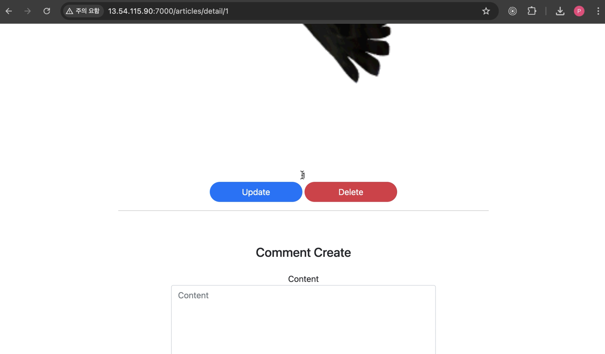
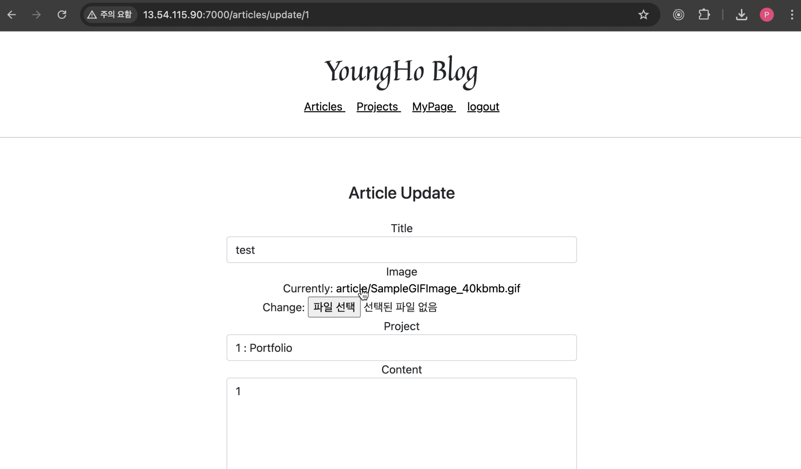
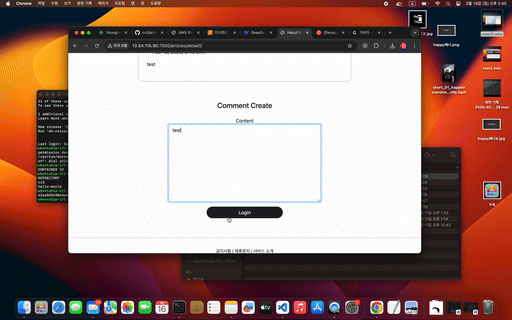
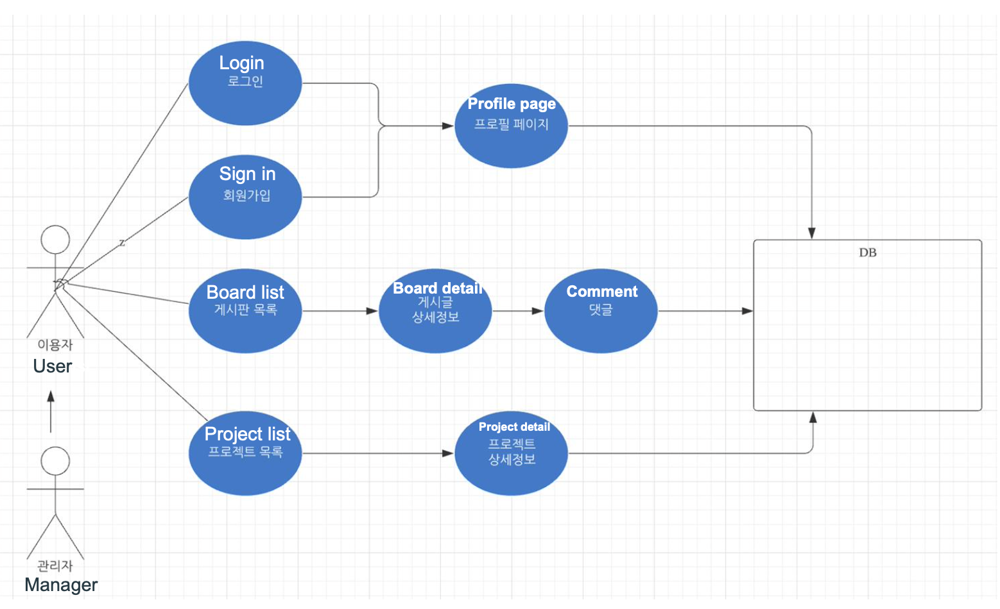
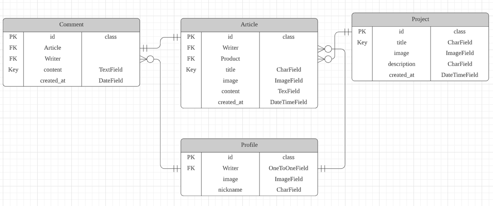
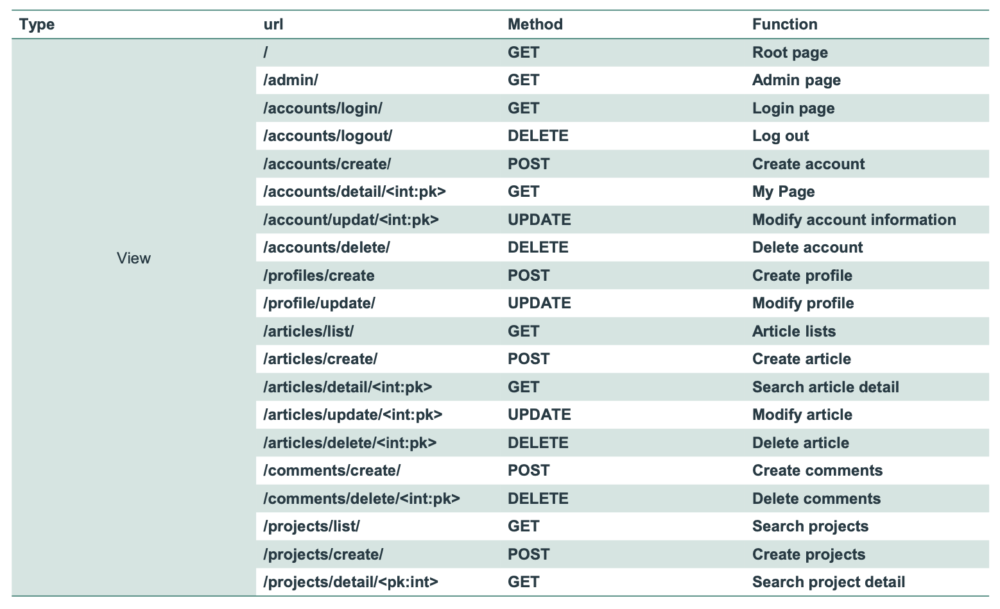

# Deploying a Django Web application to AWS using Docker


<div style="display: flex; justify-content: space-around;">
  
  
  
</div>


---
---
<br>

# Feature

1. Django Framework: <br> 
The Django framework's powerful features were utilized to develop an efficient and scalable web application.
<br>

2. Docker Containerization: <br>
Docker was employed to standardize the deployment environment and streamline the deployment process. A Dockerfile was written to containerize the web application, and a Docker image was built based on this Dockerfile.
<br>

3. Amazon EC2 Deployment: <br>
An instance was created on Amazon EC2 to deploy the web application, establishing a stable and flexible deployment environment. Subsequently, the built Docker image was deployed to the EC2 instance.
<br>

4. Domain Connection: <br>
The domain was connected to the public IP address of the assigned EC2 instance, enabling easy access to the web application through a user-friendly domain address.
<br>


---
---
<br>

# Core technologies

Client : HTML,CSS,JavaScript<br>
Server : Python, Django, SQLlite<br>
DevOps : Docker<br>

---
---
<br>

# Deployment

## 1. Install Docker in AWS EC2

```bash

sudo apt update

sudo apt install software-properties-common

url -fsSl https://download.docker.com/linux/ubuntu/gpg | sudo apt-key add -

sudo add-apt-repository "deb [arch=amd64] https://download.docker.com/linux/ubuntu bionic stable" 

apt-cache policy docker-ce

sudo apt install docker-ce

sudo docker pull hello-world

sudo docker run hello-world

```

## 2. Run docker file in EC2

```bash

Git clone https://github.com/sudoyh/Django_Docker_AWS.git

Cd Django_Docker_AWS

Sudo docker build -t django .

sudo docker run -d -it -p 0.0.0.0:7000:7000/tcp django

```

Note: Open port 7000 in the security group settings
<br>


---
---
<br>

# Full video link 

Youtube : 


[📺 Youtube Link : https://youtu.be/u7PDZT8eYUw ](https://youtu.be/u7PDZT8eYUwD)

---
---
<br>

# Demo




---
---
<br>

# Use case




---
---
<br>

# Domain ERD




---
---
<br>

# API list



